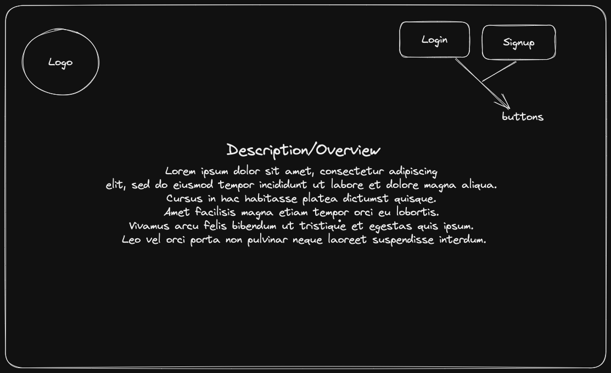
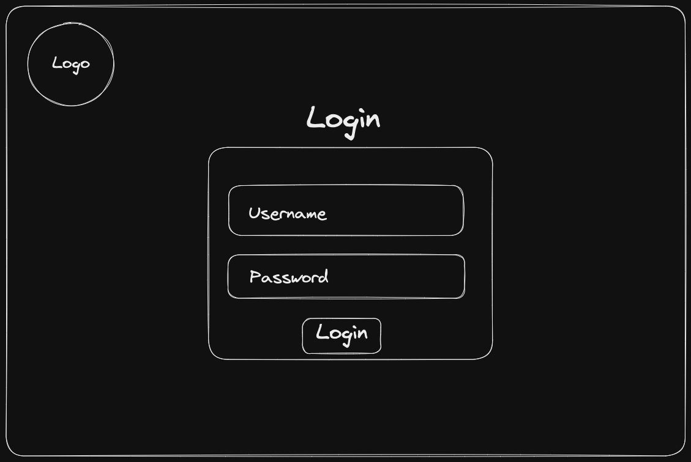
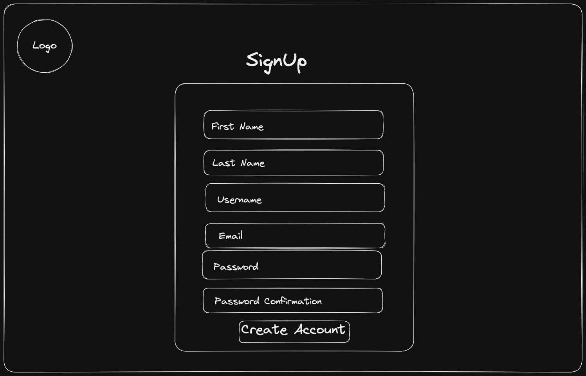
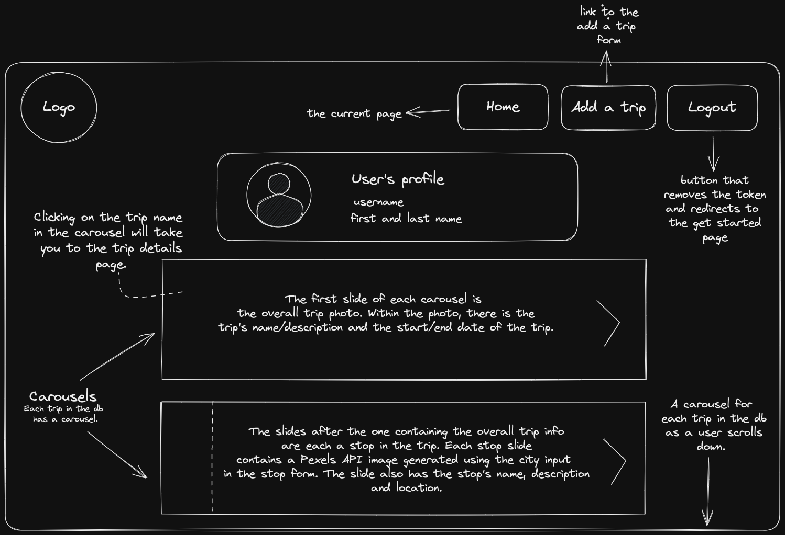
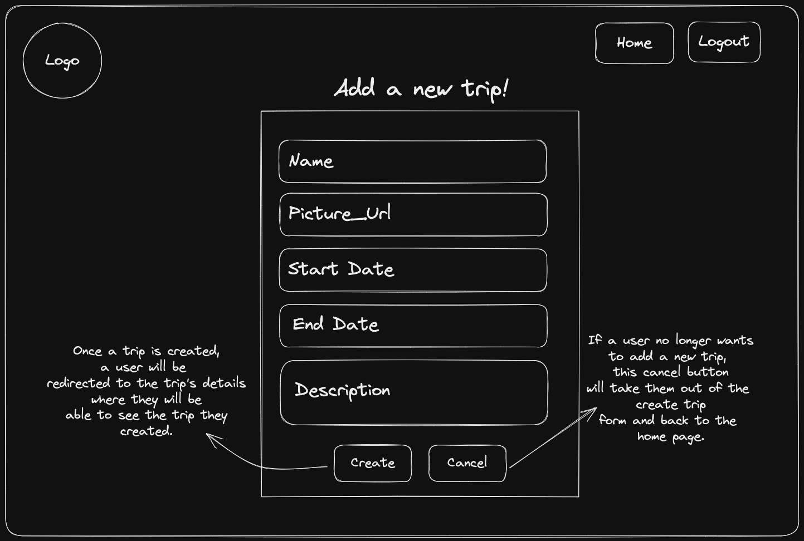
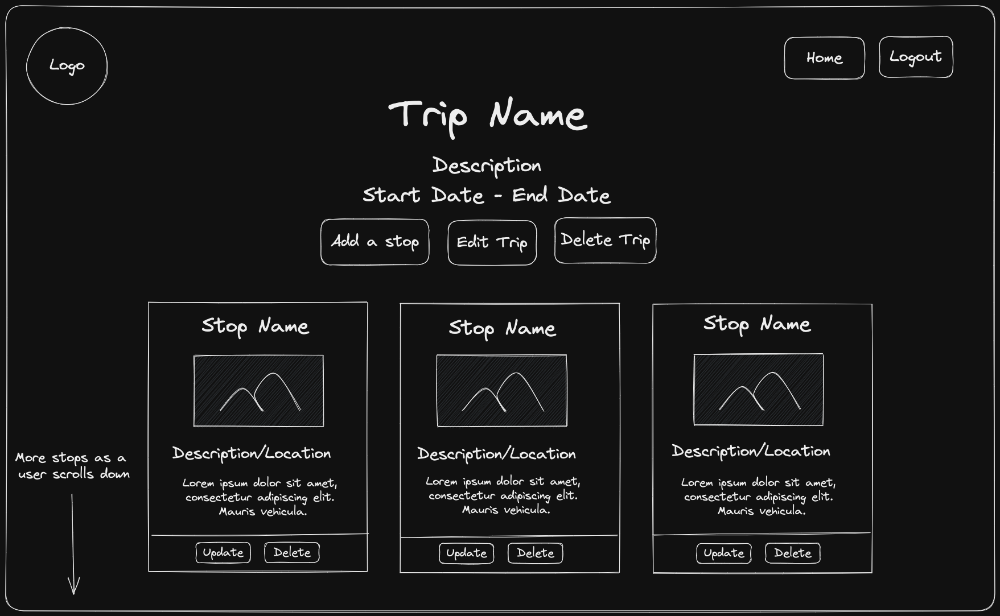
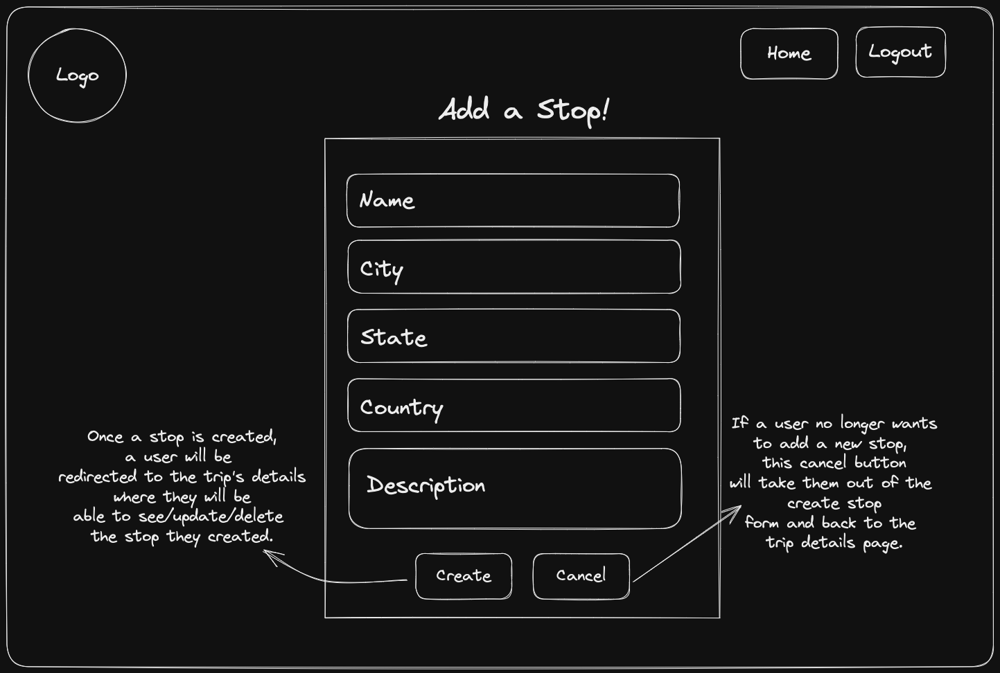
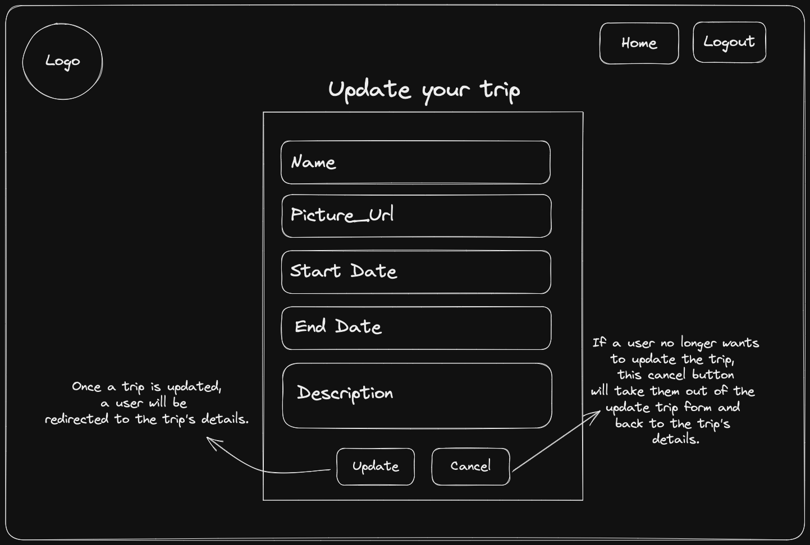
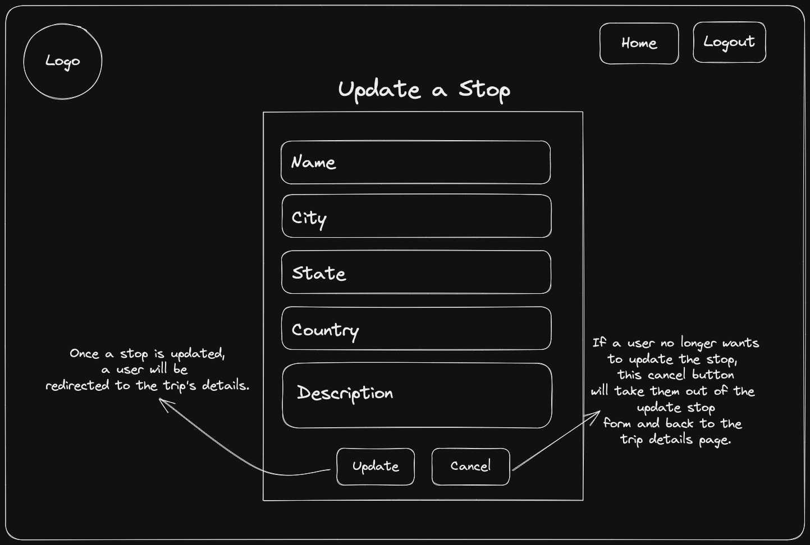

## Project Documentation

Tripper:
    Created by:
            Layla Hashmi,
            Khalid Abdullahi,
            Dominic Ferraro

    Overview:
            Tripper is a travel journal designed for the new age nomad.
            Our team of creators has made a beautiful and intuitive application
            that allows users to create a history of all their amazing travels
            including each stop made along the way. Tripper travelers can include
            their favorite photo as the main display of the trip and let the smart
            app provide a professional picture for each related stop. All the fun had
            along the way can be documented in each stop, and an overview of the
            entire trip will remind our users what they did every time they go to
            the home page.

    API Design:
            Trips:
                - **Method**: `POST`, `GET`, `GET`, `PUT`, `DELETE`
                - **Path**: `/api/trips`, `/api/trips/{trip_id}`, `/api/trips/stops/{stop_id}`

                Trip Input:

                    ```json
                    {
                        "name": string,
                        "picture_url": string,
                        "start_date": string,
                        "end_date": string,
                        "description": string,
                    }
                    ```

                Trip Output:

                    ```json
                    {
                        "name": string,
                        "picture_url": string,
                        "start_date": string,
                        "end_date": string,
                        "description": string,
                        "id": string,
                        "stops": [
                            {
                            "name": string,
                            "street": string,
                            "state": string,
                            "city": string,
                            "description": string,
                            "id": string,
                            "picture_url": string,
                            }
                        ],
                    }
                    ```

                Stop Input:

                    ```json
                    {
                        "name": string,
                        "street": string,
                        "state": string,
                        "city": string,
                        "description": string,
                    }
                    ```

                Stop Output:

                    ```json
                    {
                        "name": string,
                        "street": string,
                        "state": string,
                        "city": string,
                        "description": string,
                        "id": string,
                        "picture_url": string,
                    }

            Creating a new trip will provide a key 'stops' which will contain an empty list. When a stop is added, it will be an object in the list of stops. Picture_url is provided by the pexels API for each stop. Picture_url for a trip will be provided by the user. Ids are created by mongoDB when the trip, stop, or user is created then added to the data. The database attaches the current user's information to every created trip and blocks access to that data from any other user. A user only has access to their own creations.

            Accounts:
                - **Method**: `POST`, `GET`, `DELETE`
                - **Path**: `api/accounts`, `/token`

                Signup Input:

                    ```json
                    {
                        "first_name": string,
                        "last_name": string,
                        "username": string,
                        "email": string,
                        "password": string
                    }
                    ```
                Signup Output:

                    ```json
                    {
                        "access_token": "string",
                        "token_type": "Bearer"
                    }
                    ```

                Login Input:

                    ```json
                    {
                        "username": string,
                        "password": string
                    }
                    ```

                Login Output:

                    ```json
                    {
                        "access_token": string,
                        "token_type": "Bearer"
                    }
                    ```

                Logout Input:

                    ```json
                    {
                        "access_token": string
                    }
                    ```

                Logout Output:

                    ```json
                    {
                        bool
                    }
                    ```

            When a user account is created it will automatically be logged in, and an authorization token will be attached to the account in the form of a cookie while the user is logged in.
            This authorization cookie is necessary to access any part of the application other than the home page and login/signup forms.


            Pexels Third Party API:
                - **Method**: `GET`,
                - **Path**: `api/pexels{city}`

                Input:

                    ```json
                    {
                        "photos": [
                            string
                            ]
                    }

            A GET request is sent to this endpoint every time a new stop is created, then the returned data is filtered through and the correct picture url is pulled off and added into the stop data.


    Data Models:
            All data is stored in mongoDB in the same shape as previously listed in the API Design section. There are two collections in the database consisting of 'users' and 'trips'. The 'users' collection stores all account information while the 'trips' collection stores all trip data.


    Integrations:

            The application will need to get the following kinds of data from third-party sources:
            Images of cities from Pexels API. The images will be selected based off of the information in the city field of the create stop form.

    GHI:

    # User Graphical Human Interface

        ## Get Started Page

        This will be the first page visitors arrive to on the website.
        There will be links to the about, login and signup pages.

        

        ## About Page

        - Contains a brief description of Tripper

        

        ## User Account Pages

        - Login Page
        - Sign Up Page

        Users with existing accounts can login into their account. If a user wants to create a new account they can do so here.

        
        

        ## Home Page

        After a user logs in, they will be redirected to this page. On this page is their account information such as username, first/last name and email. This page also contains all of the trips that a user has created in the form of a carousel.

        

        ## Creating a Trip

        Users can click on the Add a trip button on the homepage to add a new trip. Clicking the create button will add the trip and all of it's relevant info as a carousel to the homepage.

        

        ## Trip Details Page

        - Create a stop
        - Update a trip
        - Update a stop

        Users can click on a specific trip in the home page to be taken to the trip's details page. From here the user can edit/delete a trip as well as view all the stops on their trip and add/update/delete them if they'd like.

        
        
        
        
